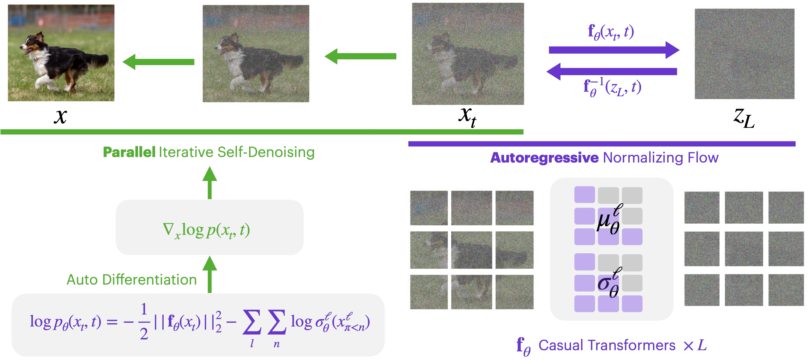

# iTARFlow: Iterative Transformer Autoregressive Flows

This repo contains code for Normalizing Flow with Iterative Denoising (iTarFlow).



## Setup

```bash
pip install -r requirements.txt
```

### Data Preparation

1. Place datasets under `data/`:
   - i.e `data/imagenet/`

2. Pre-compute FID statistics for each dataset/resolution:
```bash
# ImageNet 64x64
torchrun --standalone --nproc_per_node 8 prepare_fid_stats.py --dataset imagenet --img_size 64

# ImageNet 128x128
torchrun --standalone --nproc_per_node 8 prepare_fid_stats.py --dataset imagenet --img_size 128

# ImageNet 256x256
torchrun --standalone --nproc_per_node 8 prepare_fid_stats.py --dataset imagenet --img_size 256
```

## Training
### ImageNet 64x64

```bash
torchrun --standalone --nproc_per_node 8 train.py \
  --dataset imagenet --img_size 64 \
  --patch_sizes 2 --channels 1280 --layers_per_block 4 4 4 24 \
  --batch_size 512 --epochs 300 --cfg 2.1 --drop_label 0.1  --t0 1e-2 --t1 3e-1\
  --reweight t --xflip 1 --ckpts_to_keep 20 \
  --sample_freq 10 --tag imagenet64
```

### ImageNet 128x128

```bash
torchrun --standalone --nproc_per_node 8 train.py \
  --dataset imagenet --img_size 128 \
  --patch_sizes 4 --channels 1600 --layers_per_block 4 4 4 24 \
  --batch_size 512 --epochs 450 --cfg 2.1 --drop_label 0.1  --t0 1e-2 --t1 5e-1\
  --reweight t --xflip 1 --ckpts_to_keep 20 \
  --sample_freq 10 --tag imagenet128
```

### ImageNet 256x256

```bash
torchrun --standalone --nproc_per_node 8 train.py \
  --dataset imagenet --img_size 256 \
  --patch_sizes 8 --channels 2176 --layers_per_block 4 4 4 24 \
  --batch_size 512 --epochs 600 --cfg 2.1 --drop_label 0.0  --t0 1e-2 --t1 7e-1\
  --reweight t --xflip 1 --ckpts_to_keep 20 \
  --sample_freq 10 --tag imagenet256
```

## Evaluation (FID) (change the argument to your config accordingly if you chagne them)

### ImageNet 64x64

```bash
torchrun --standalone --nproc_per_node 8 evaluate_fid.py \
  --dataset imagenet --img_size 64 \
  --patch_sizes 2 --channels 1280 --layers_per_block 4 4 4 24 \
  --ckpt_file <path_to_checkpoint.pth> \
  --cfg 2.1 --t0 1e-2 --t1 3e-1 --sample_batch_size 1024 --denoising_batch_size 256
```

### ImageNet 128x128

```bash
torchrun --standalone --nproc_per_node 8 evaluate_fid.py \
  --dataset imagenet --img_size 128 \
  --patch_sizes 4 --channels 1600 --layers_per_block 4 4 4 24 \
  --ckpt_file <path_to_checkpoint.pth> \
  --cfg 3.7 --t0 1e-2 --t1 5e-1 --sample_batch_size 600 --denoising_batch_size 200
```

### ImageNet 256x256

```bash
torchrun --standalone --nproc_per_node 8 evaluate_fid.py \
  --dataset imagenet --img_size 256 \
  --patch_sizes 8 --channels 2176 --layers_per_block 4 4 4 24 \
  --ckpt_file <path_to_checkpoint.pth> \
  --cfg 4.2 --t0 1e-2 --t1 7e-1\
  --sample_batch_size 720 --denoising_batch_size 144
```

